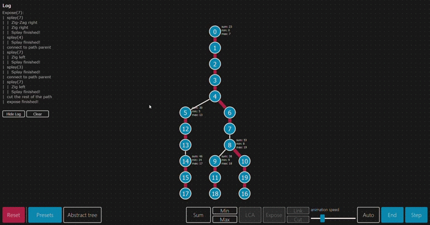

# Link-Cut-Treeez

Link cut trees visualization.

# Abstract/represented tree

# Concrete/auxiliary tree

# A brief explanation of what it is
Link cut tree is able to perform the following operations in O(log(n)) amortized time:
- path-aggregate operations (on the path form node v to its root)
  - sum(v)
  - min(v)
  - max(v)
- find_root(v)
- LCA(v, u);
- add_const(v) (not implemented) - add a constant to each node on the path from v to its root

### Abstract or represented tree
Abstract tree is not stored in the memory; it's the way we imagine a link-cut tree when working with it, thus the name.
Each node can have an unlimited number of children and one prefered child (has red edge on the visualisation).
A chain of preferred children forms a preferred path. 

expose(v) seelects all the edges on the path from v to its root to make the path prefered.
The path-aggregate operations described above are performed on prefered paths.

### Concrete or auxiliary tree
The way link-cut tree is actually stored in the memory.
It's a forest of splay trees where each splay tree represents a phrefered path in the Abstract tree.
The root of each splay tree contains a path-parent pointer to the path's predecessor in the abstract tree.

## I waas adding those while developing the program:
## Update1:

## Update2:

## Update3

## Update4

## Update5

## Update6

